Active-Directory-attack-lab
Evaluación de seguridad de tipo caja negra sobre una infraestructura de laboratorio con máquinas Linux y Windows unidas a un dominio de Active Directory. El objetivo: partir de un acceso externo sin credenciales y llegar al control total del controlador de dominio (DC).
> ⚠️ Laboratorio propio en red aislada (sin acceso a internet). IPs, dominios, credenciales y hashes pertenecen a este entorno de pruebas y no corresponden a ningún sistema real.
Resumen ejecutivo
	
Tipo de prueba	Caja negra
Resultado	Control total del dominio (Golden Ticket)
Riesgo global	🔴 Crítico
Cadena de ataque	FTP anónimo → RCE web → credenciales en texto plano → pivoting → Kerberoasting → Golden Ticket
Durante la evaluación se logró comprometer un servidor Linux expuesto, obtener credenciales almacenadas en archivos del sistema, moverse lateralmente hacia una máquina Windows del dominio, extraer y crackear el hash de una cuenta de servicio vulnerable a Kerberoasting, y finalmente generar un Golden Ticket con el hash NTLM de `krbtgt`, obteniendo persistencia y privilegios de administrador de dominio.
Arquitectura
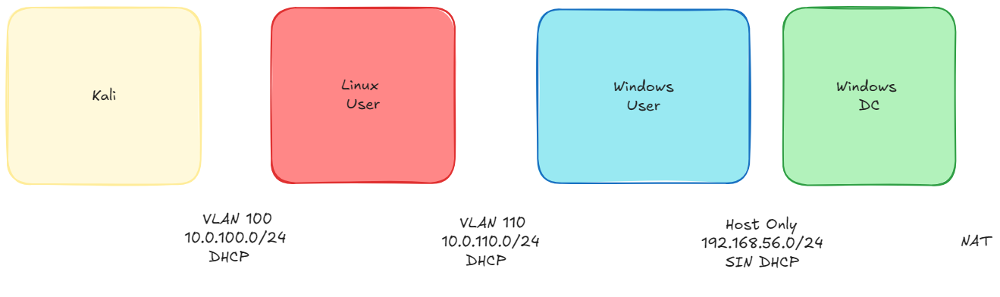
Segmento	Rango	DHCP	Máquina
VLAN 100	10.0.100.0/24	Sí	Kali (atacante)
VLAN 110	10.0.110.0/24	Sí	Linux User
Host Only	192.168.56.0/24	No	Windows User
NAT	—	—	Windows DC
Herramientas empleadas
Nmap · Gobuster · Hashcat · PowerView · Mimikatz · sqlmap · crackmapexec · proxychains · xfreerdp3
Metodología
1. Reconocimiento
IP de la máquina atacante y descubrimiento de hosts en la red:
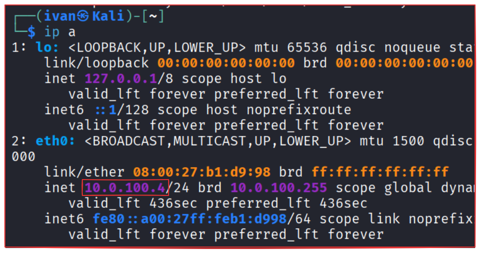
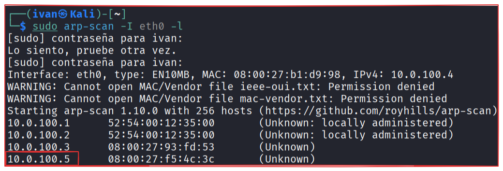
Escaneo completo de puertos del host encontrado (10.0.100.5):
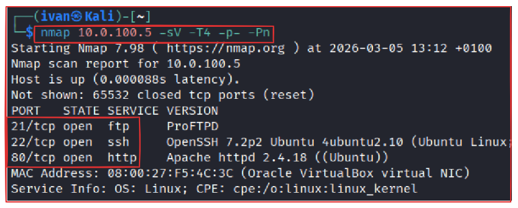
Puertos abiertos: 21 (FTP), 22 (SSH), 80 (HTTP).
2. Explotación del servidor web
Fuzzing de directorios con Gobuster:
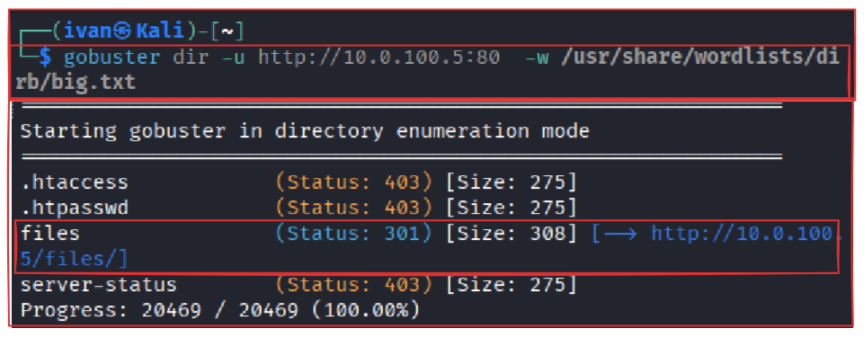
Se descubre `/files/`, con un recurso `CALL.html`:
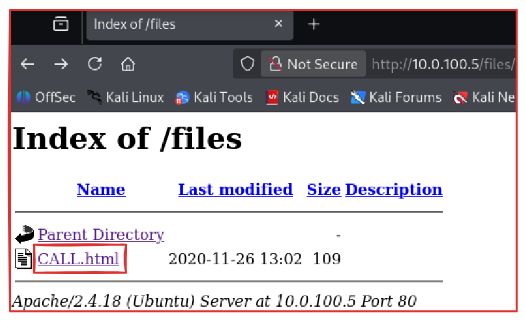
FTP con acceso anónimo habilitado — primer punto de entrada:
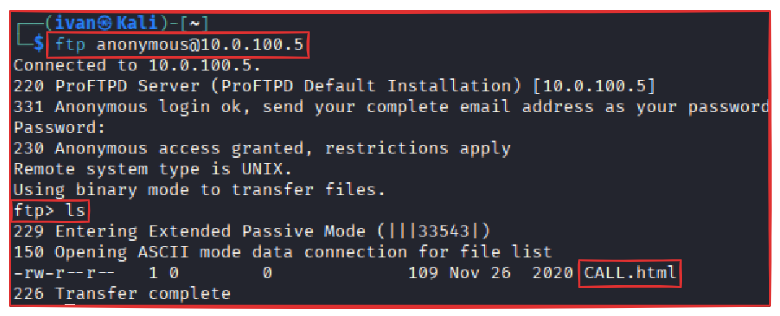
Se sube una reverse shell en PHP al mismo directorio servido por Apache:
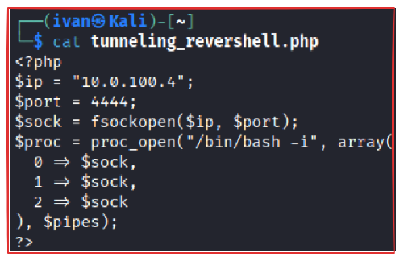
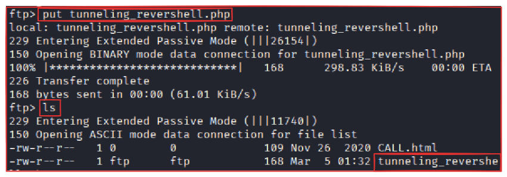
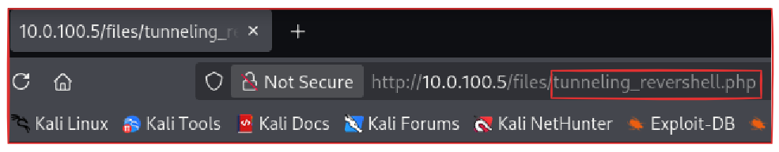
Con un listener en escucha, se invoca el payload desde el navegador y se obtiene ejecución remota de código como `www-data`:
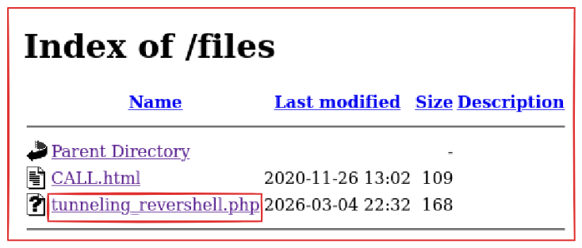
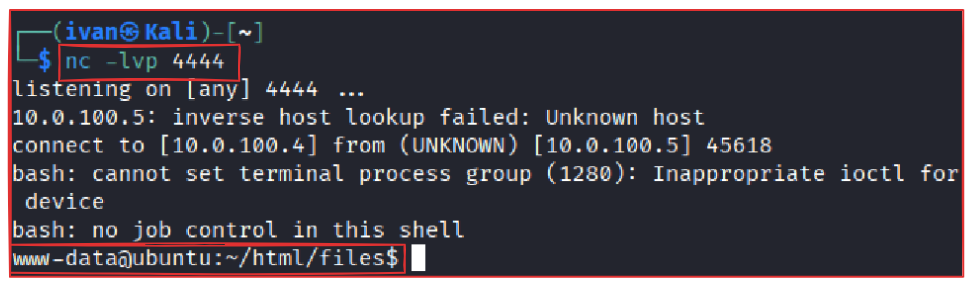
3. Compromiso del sistema Linux
Se identifica la segunda interfaz de red de este host, puente hacia la siguiente subred:
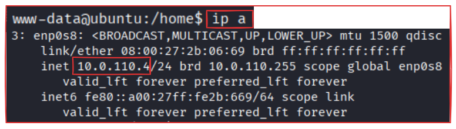
Un archivo `important.txt` indica ejecutar un script que revela credenciales Linux y Windows en texto plano:
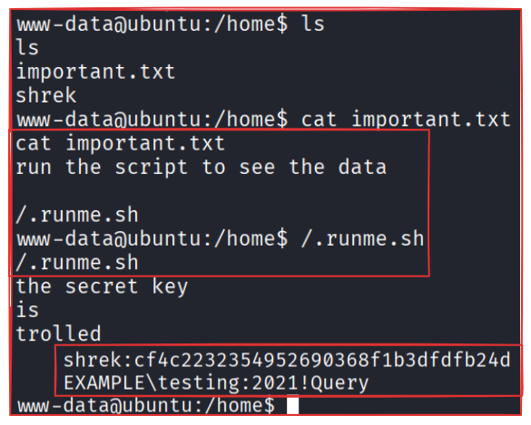
El hash MD5 de las credenciales Linux se crackea con CrackStation:
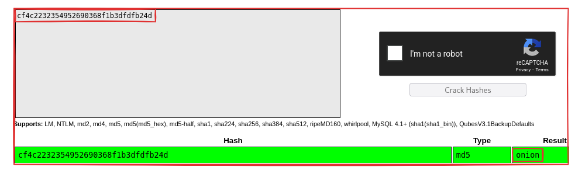
4. Pivoting de red
Con las credenciales Linux se establece un túnel SSH dinámico (SOCKS) para alcanzar la red interna donde vive la máquina Windows:
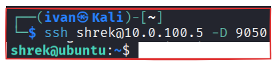
Escaneo a través de `proxychains` para localizar la máquina Windows y sus puertos relevantes:
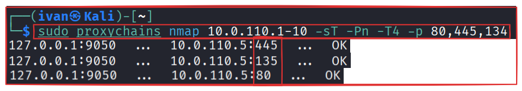
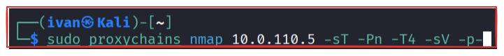
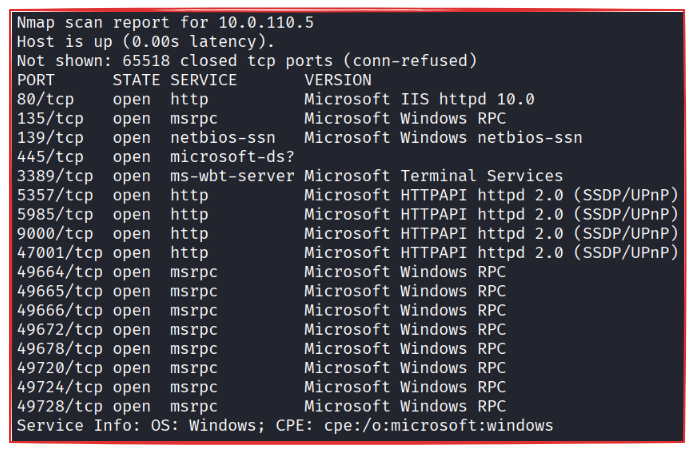
5. Acceso a la máquina Windows
Con las credenciales de dominio obtenidas, acceso remoto por RDP:
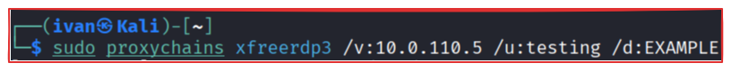
6. Enumeración del dominio
```
ipconfig
```
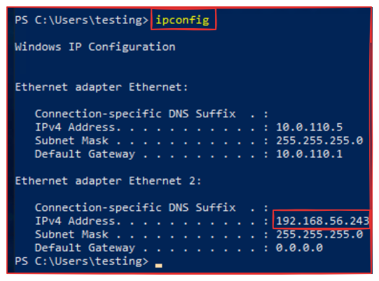
Localización del controlador de dominio con `crackmapexec`:
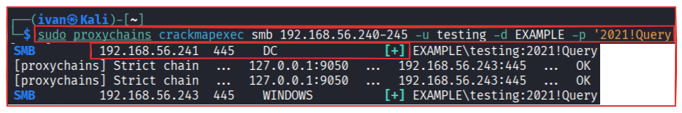
Enumeración de cuentas de servicio con SPN (candidatas a Kerberoasting):
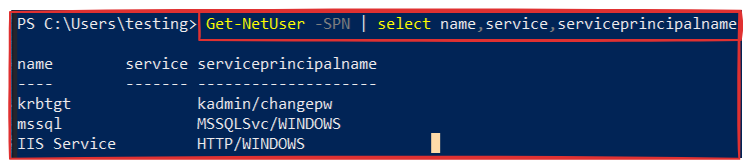
7. Kerberoasting
Extracción del ticket/hash de la cuenta de servicio `HTTP/WINDOWS`:
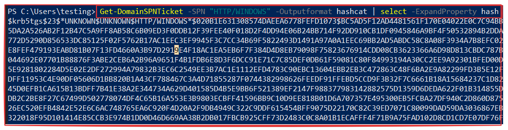
Crackeo offline con Hashcat (`-m 13100`):
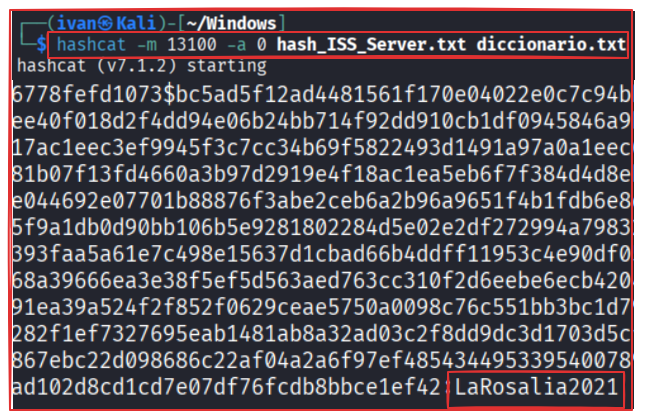
La contraseña obtenida (`LaRosalia2021`) resulta válida también para autenticarse directamente en el dominio como esa cuenta de servicio:
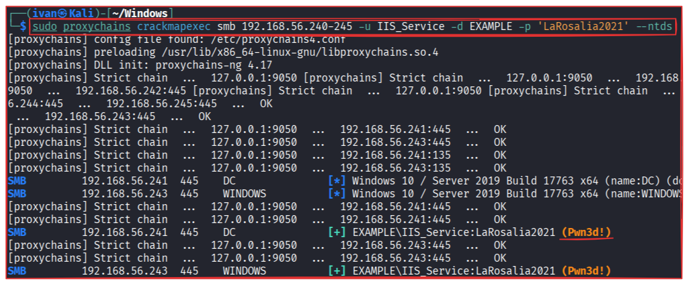
8. Escalada de privilegios — Golden Ticket
Se extraen los hashes NTDS del dominio, incluyendo el de la cuenta `krbtgt`:
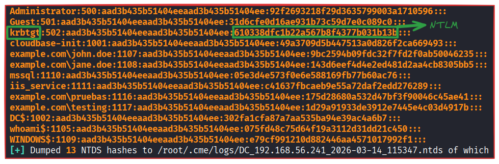
Datos necesarios para construir el Golden Ticket, obtenidos con PowerView:
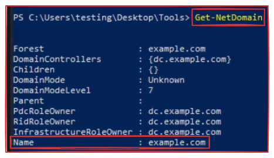
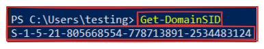
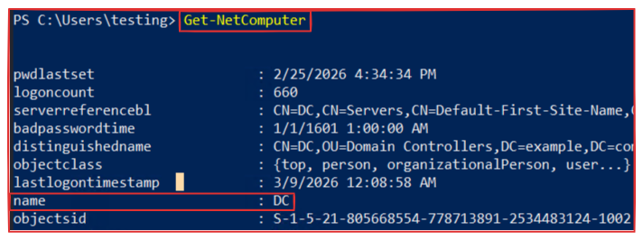
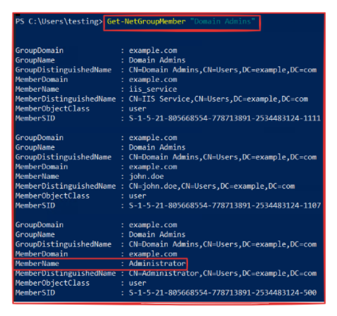
Usuario a suplantar: `Administrator` (RID 500):

9. Persistencia
Generación del Golden Ticket con Mimikatz:
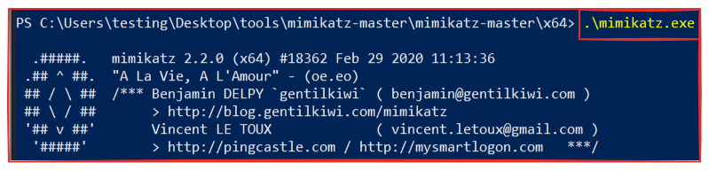
```
kerberos::golden /domain:example.com /sid:S-1-5-21-805668554-778713891-2534483124 \\\\
/rc4:610338dfc1b22a567b8f4377b031b13b /user:Administrator /id:500 /ptt
```
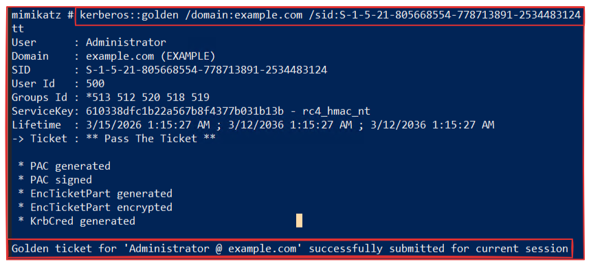
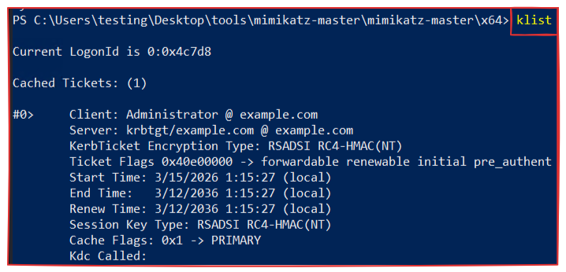
Acceso final al controlador de dominio como administrador:
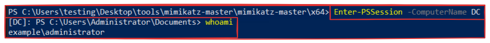
Vulnerabilidades identificadas
ID	Vulnerabilidad	CWE	CVSS est.	Severidad
V1	Acceso FTP anónimo habilitado	CWE-284	7.5	Alto
V2	Permisos de escritura en directorio web	CWE-434	9.8	Crítico
V3	Credenciales almacenadas en archivos del sistema	CWE-522	9.0	Crítico
V4	Política de contraseñas débil	CWE-521	7.5	Alto
V5	Falta de segmentación de red	CWE-284	8.0	Alto
V6	Reutilización de credenciales entre sistemas	CWE-798	8.5	Alto
V7	Cuentas de servicio vulnerables a Kerberoasting	CWE-522	8.8	Alto
V8	Privilegios excesivos en cuentas de servicio	CWE-269	9.0	Crítico
V9	Exposición del hash de la cuenta krbtgt	CWE-522	10.0	Crítico
V10	Compromiso del controlador de dominio	CWE-284	10.0	Crítico
Recomendaciones clave
Deshabilitar el acceso FTP anónimo
Aplicar una política de contraseñas robusta
Eliminar credenciales almacenadas en archivos de texto plano
Segmentar adecuadamente las redes internas
Aplicar el principio de mínimo privilegio en cuentas técnicas
Proteger las cuentas de servicio (contraseñas largas y aleatorias, gMSA)
Rotar periódicamente la contraseña de `krbtgt`
Conclusión
El escenario reproduce un patrón habitual en incidentes reales: un servicio mal configurado expuesto a internet (FTP anónimo) es el punto de partida de una cadena que, combinando fallos individualmente moderados —credenciales en texto plano, contraseñas débiles, ausencia de segmentación, cuentas de servicio mal protegidas—, termina en el compromiso total de Active Directory. Ninguna de las vulnerabilidades por separado sería crítica; la cadena completa sí lo es.
---
Informe elaborado por Iván Salvador Santamaría · Laboratorio de práctica en entorno aislado.
